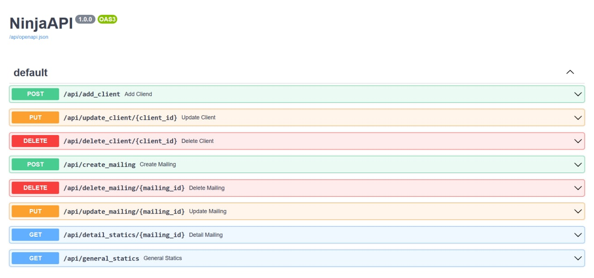

# Сервис уведомлений

### Что было реализовано
- основное задание
-  docker-compose для запуска всех сервисов проекта одной командой
- страница со Swagger UI
- откладывание запросов в случае проблем с внешним сервисом (*если внешний сервис не вернул 200, то следующая попытка отправки ставится на время её окончания*)

### Интеграция с внешним сервисом

Для работы с внешним сервисом, указанным в задании, нужно прописать **токен** в **.env** файле. (*сейчас там прописан тот, который был выдан мне*)

### Используемые технологии
- Django
- [django-ninja](https://github.com/vitalik/django-ninja) (*для создания API*)
- Postgres
- Celery & Redis (*для отправки рассылок*)
- Docker


### Запуск

``` docker-compose run --build```

### Документация

``` http://localhost/api/docs#/ ```

**приложение работает на 80 порту*
